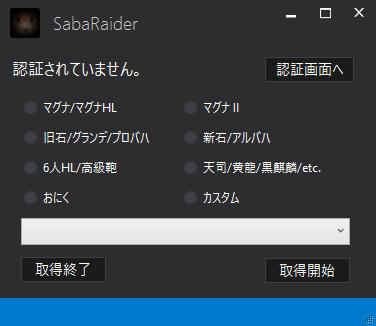
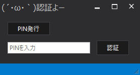
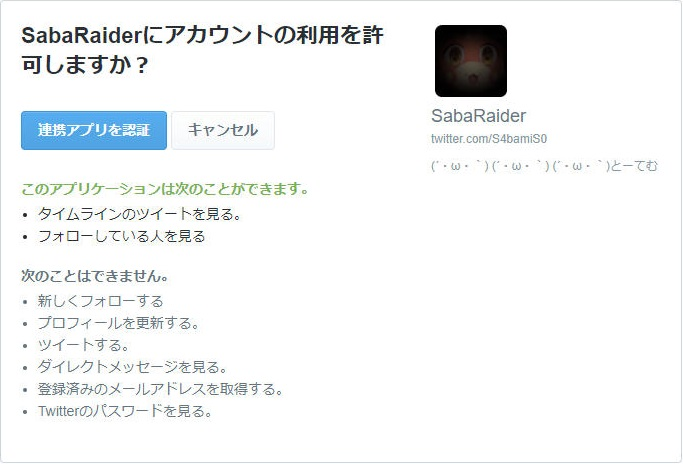
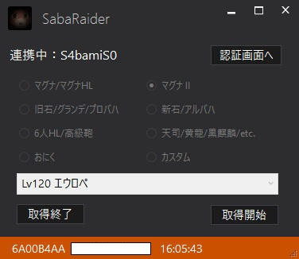
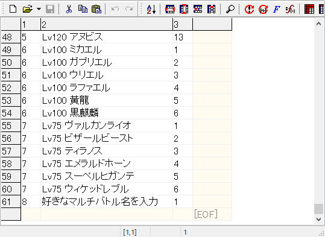

# SabaRaider

<!-- TOC depthFrom:1 depthTo:6 withLinks:1 updateOnSave:1 orderedList:0 -->

- [SabaRaider](#sabaraider)
	- [できること](#できること)
	- [他救援ツールとの違い](#他救援ツールとの違い)
	- [ファイル構成](#ファイル構成)
	- [使用方法](#使用方法)
		- [0.SabaRaider.exeをダブルクリックで起動](#0sabaraiderexeをダブルクリックで起動)
		- [1.ツイッター認証](#1ツイッター認証)
		- [2.マルチバトルを選択](#2マルチバトルを選択)
	- [注意点](#注意点)
	- [エラー落ち豚](#エラー落ち豚)
	- [マルチバトル追加のやり方](#マルチバトル追加のやり方)
	- [作った豚小屋の住所](#作った豚小屋の住所)
	- [ライセンス](#ライセンス)

<!-- /TOC -->

## できること
指定したマルチバトルの救援IDを、**自動でクリップボードに貼り付けていく。**  
(´・ω・｀)おほーっ  
(´・ω・｀)ひたすらCtrl+Vを押せばいいのね  
(´・ω・｀)じゅわあくるくる  
(入りたいバトルは選べないのが玉に瑕)  

## 他救援ツールとの違い
- [Raid Finder](http://gbf-raidfinder.aikats.us/)さんとかに(勝手に)代表されるWebサイトの救援ツールはとても便利で高機能だけど、ブラウザによる仕様で許可なしにクリップボードへ貼り付けられなかったりする。

- 似たようなことしてるのがこちらの[gbf-rapid-search](http://mizuff.hatenablog.com/entry/gbf-rapid-search)さん。  
というかほぼ上位互換です生きててごめんなさい。  
コンソールでPythonファイル叩くだけでWindowsでもMacでも動いちまうんだ！  
Pythonの実行環境とTwitterの自前APIKeyが必要で、ある程度PC知識がないときつそうな。  
(´・ω・｀)らんらんは豚だから難しいことはわからないよ  

## ファイル構成
- SabaRaider.exe  
 (´・ω・｀)オイラはらんらん！  
- RaidBattleList.csv  
自由に検索したいマルチバトルが追記/修正できちまうんだ！  
- userInfo.config(本アプリの中で作成される)  
Twitterへのアクセスキー情報  
やったねたえちゃん！認証がスキップできるよ！    
- readme.md
- image/*  
こ↑れ↓

## 使用方法
### 0.SabaRaider.exeをダブルクリックで起動

  

### 1.ツイッター認証
すでにuserInfo.configで認証できている(連携中：〇〇〇)ならば2.へ。  
「認証されていません。」と表示されている場合、右上の「認証画面へ」ボタンをクリック。    

  

「PIN発行」をクリックするとブラウザが立ち上がるのでTwitterにログイン。  

  

「連携アプリを認証」をクリックすると7桁のPINコードが発行されるので、コピーして認証画面に貼り付け。  
「認証」をクリックで完了。  
このとき、認証情報の保存に対して「はい」を選ぶと、前述のuserInfo.configが作成され、次回からの認証がなくなります。  

### 2.マルチバトルを選択
ラジオボタンでカテゴリを、プルダウンでマルチバトルを選んだら、右下の「取得開始」をクリック。  

  

救援ツイを見つけると画面下部に申し訳程度のツイ情報が。  
この時点でクリップボードには貼り付けられてるはずなので、気にせずマルチに入って殴るのだ。  
終わり！閉廷！…以上！皆解散！

## 注意点
 - 短時間で取得開始/終了を繰り返すとAPI接続制限に達する！達する！  
メッセージが出て強制終了かかるので、しばらく時間を置いてみてください。  
浮気せずに1個だけ選んでがっつり殴りまくろうね！(開き直り)

 - 多重起動は全く考慮していない(どうせ1つのクリップボードを食い合う)ので、複数起動しても片方がぬるぽ。ｶﾞｯ

 - 再配布は自己責任でよろしくお願いしますなんでもしますから。  
 その場合userInfo.configだけはしっかり消そうね・・・！

## エラー落ち豚
再☆起☆動

## マルチバトル追加のやり方
エディタでRaidBattle.csv開く。  
メモ帳でもExcelでもいいけどcsv用のエディタだとマル。  
(´・ω・｀)らんらんのお気に入りは[Cassava Editor](https://forest.watch.impress.co.jp/library/software/cassavaedit/)  

  

列は左から順にカンマ区切りで、  
1.マルチバトルの種類  
2.検索ワード  
3.表示順  
なので、「カスタム」ラジオボタンに追加したい場合は  

8,Lv20 グリフォン,1  
8,Lv20 ザリチュナルフレイム,2  

みたいに追加でおｋ。  

## 作った豚小屋の住所
今日は特別に住所を公開するよ！　--瞬殺のコルバルト--  
Twitter: S4bamiS0  
きくうしID: 6746908  
(´・ω・｀)ガバガバエラーでても許して？  

## ライセンス
 - SabaRaiderはMITライセンスです。LICENSEを参照してください。
 - ソリューション内で利用しているMITライセンスのパッケージは以下の通りです。

KanColleViewerのUIに憧れてMetroRadianceを使用させて頂きました！

 | パッケージ      	| ライセンス  	|
 |:-----------------	|:-------------	|
 | CoreTweet       	| MIT License 	|
 | Newtonsoft.Json 	| MIT License 	|
 | MetroRadiance   	| MIT License 	|

以下に条文を示します。

CoreTweet
> The MIT License (MIT)
>
> CoreTweet - A .NET Twitter Library supporting Twitter API 1.1
> Copyright (c) 2014 lambdalice
>
> Permission is hereby granted, free of charge, to any person obtaining a copy
> of this software and associated documentation files (the "Software"), to deal
> in the Software without restriction, including without limitation the rights
> to use, copy, modify, merge, publish, distribute, sublicense, and/or sell
> copies of the Software, and to permit persons to whom the Software is
> furnished to do so, subject to the following conditions:
>
> The above copyright notice and this permission notice shall be included in
> all copies or substantial portions of the Software.
>
> THE SOFTWARE IS PROVIDED "AS IS", WITHOUT WARRANTY OF ANY KIND, EXPRESS OR
> IMPLIED, INCLUDING BUT NOT LIMITED TO THE WARRANTIES OF MERCHANTABILITY,
> FITNESS FOR A PARTICULAR PURPOSE AND NONINFRINGEMENT. IN NO EVENT SHALL THE
> AUTHORS OR COPYRIGHT HOLDERS BE LIABLE FOR ANY CLAIM, DAMAGES OR OTHER
> LIABILITY, WHETHER IN AN ACTION OF CONTRACT, TORT OR OTHERWISE, ARISING FROM,
> OUT OF OR IN CONNECTION WITH THE SOFTWARE OR THE USE OR OTHER DEALINGS IN
> THE SOFTWARE.

----

Newtonsoft.Json
>The MIT License (MIT)
>
>Copyright (c) 2007 James Newton-King
>
>Permission is hereby granted, free of charge, to any person obtaining a copy of
>this software and associated documentation files (the "Software"), to deal in
>the Software without restriction, including without limitation the rights to
>use, copy, modify, merge, publish, distribute, sublicense, and/or sell copies of
>the Software, and to permit persons to whom the Software is furnished to do so,
>subject to the following conditions:
>
>The above copyright notice and this permission notice shall be included in all
>copies or substantial portions of the Software.
>
>THE SOFTWARE IS PROVIDED "AS IS", WITHOUT WARRANTY OF ANY KIND, EXPRESS OR
>IMPLIED, INCLUDING BUT NOT LIMITED TO THE WARRANTIES OF MERCHANTABILITY, FITNESS
>FOR A PARTICULAR PURPOSE AND NONINFRINGEMENT. IN NO EVENT SHALL THE AUTHORS OR
>COPYRIGHT HOLDERS BE LIABLE FOR ANY CLAIM, DAMAGES OR OTHER LIABILITY, WHETHER
>IN AN ACTION OF CONTRACT, TORT OR OTHERWISE, ARISING FROM, OUT OF OR IN
>CONNECTION WITH THE SOFTWARE OR THE USE OR OTHER DEALINGS IN THE SOFTWARE.

----

MetroRadiance
>The MIT License (MIT)
>
>Copyright (c) 2014 Manato KAMEYA
>
>Permission is hereby granted, free of charge, to any person obtaining a copy
>of this software and associated documentation files (the "Software"), to deal
>in the Software without restriction, including without limitation the rights
>to use, copy, modify, merge, publish, distribute, sublicense, and/or sell
>copies of the Software, and to permit persons to whom the Software is
>furnished to do so, subject to the following conditions:
>
>The above copyright notice and this permission notice shall be included in all
>copies or substantial portions of the Software.
>
>THE SOFTWARE IS PROVIDED "AS IS", WITHOUT WARRANTY OF ANY KIND, EXPRESS OR
>IMPLIED, INCLUDING BUT NOT LIMITED TO THE WARRANTIES OF MERCHANTABILITY,
>FITNESS FOR A PARTICULAR PURPOSE AND NONINFRINGEMENT. IN NO EVENT SHALL THE
>AUTHORS OR COPYRIGHT HOLDERS BE LIABLE FOR ANY CLAIM, DAMAGES OR OTHER
>LIABILITY, WHETHER IN AN ACTION OF CONTRACT, TORT OR OTHERWISE, ARISING FROM,
>OUT OF OR IN CONNECTION WITH THE SOFTWARE OR THE USE OR OTHER DEALINGS IN THE
>SOFTWARE.
